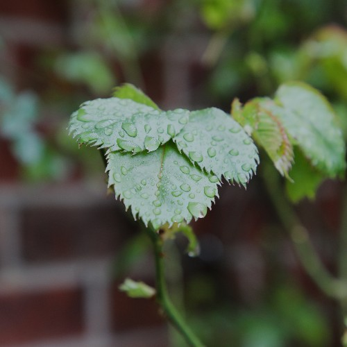
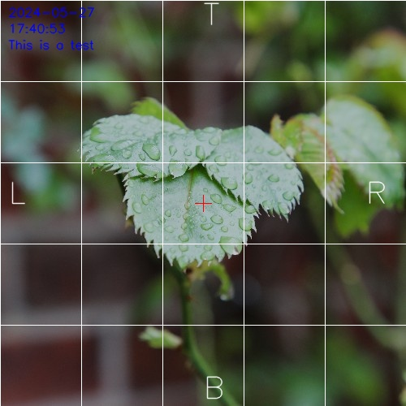
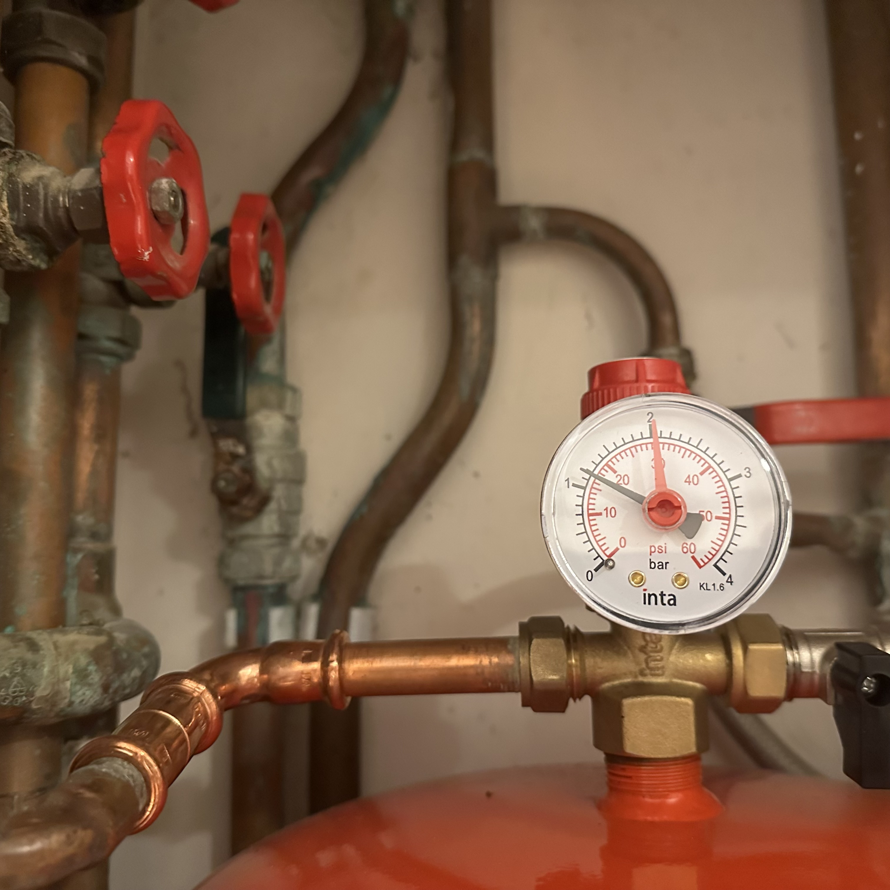

# Annotator

Quickly annotate images using JSON.

## Usage

```bash
python -m annotator <input> <input_json> <output> [variables]
```

### JSON

An example JSON file is shown below:

```json
{
    "ImageSettings": {
        "Invert": false,
        "Contrast": 0,
        "Brightness": 0,
        "Saturation": 0,
        "Hue": 0,
        "FlipHorizontal": false,
        "FlipVertical": false,
        "Rotate": 0
    },
    "ImageOverlays": {
        "Crosshair": {
            "Enabled": true,
            "Colour": "#0000FF",
            "Thickness": 1,
            "Size": 10,
            "Type": "Plus",
            "Offset": {
                "X": 0,
                "Y": 0
            }
        },
        "Grid": {
            "Enabled": true,
            "Colour": "#FFFFFF",
            "Thickness": 1,
            "Spacing": 100,
            "Type": "Lines"
        },
        "SideAnnotations": {
            "Enabled": true,
            "Colour": "#FFFFFF",
            "LText": "L",
            "RText": "R",
            "TText": "T",
            "BText": "B",
            "TextSize": 50,
            "TextThickness": 1
        }
    },
    "Text": [
        {
            "Text": "$DATE",
            "Position": {
                "X": 10,
                "Y": 20
            },
            "Size": 10,
            "Thickness": 1,
            "Colour": "#FF0000"
        },
        {
            "Text": "$TIME",
            "Position": {
                "X": 10,
                "Y": 40
            },
            "Size": 10,
            "Thickness": 1,
            "Colour": "#FF0000"
        },
        {
            "Text": "$V1",
            "Position": {
                "X": 10,
                "Y": 60
            },
            "Size": 10,
            "Thickness": 1,
            "Colour": "#FF0000"
        }
    ]
}

```

This will turn this image:



Into this image:



To generate this from the command line, use the following command:

```bash
python -m annotator demo/leaf.jpg demo/settings.json demo/output.jpg -v1=$TEST
```

The variables are defined by your shell and are passed to the script as arguments. To use a variable in the config file, use $vX where X is the number of the variable. And then you can pass the variable to the script using the -vX flag for example -v2=hello or -v4=$HOME.

You can define variables in bash using the following command:

```bash
export TEST="hello"
```

or in fish using:

```fish
set -x TEST hello
```
## Pre-requisites

This project requires the following packages:
- OpenCV

To install these packages, use the following command:

```bash
pip install -r requirements.txt
```

## Examples

### Gauge Demo



## Licence

This project is licenced under the GNU General Public License v3.0. See the [LICENCE](LICENCE) file for more information.

All images licenced under CC-0 (Public Domain) 